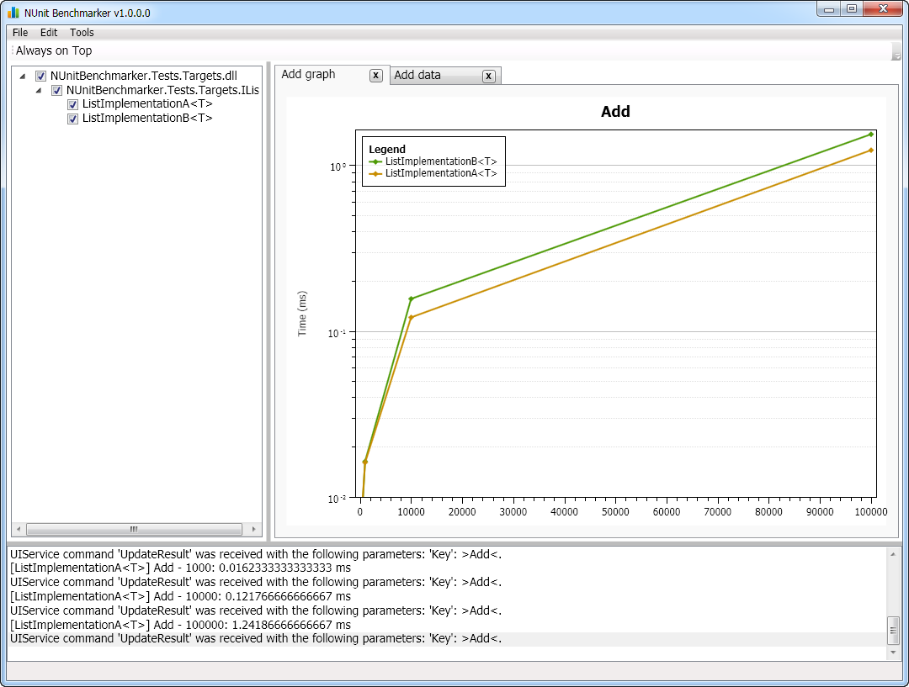

NUnitBenchmarker
================

A simple to use framework for setting up benchmarks and visualizing results in real time.

Write performance tests as you would normal unit tests with NUnit (with a little twist) and NUnitBenchmarker will take care of the rest.

 

## Features

Things NUnitBenchmarker can do for you *by writing simple unit test like code snippets*:

- Benchmarks your chosen interfaces multiple implementations
- After the test method is written, NUnitBenchmarker will
    - Look for the given interfaces implementations 
        - by configuration
        - by convention (using all the assemblies in the current folder)
    - Optionally launches the GUI, where you can load and select more additional implementations
    - Runs the benchmarks you've defined as standard NUnit test methods 
    - Displays result diagrams and data tables in the GUI
    - Creates a PDF report with the diagrams and data tables
- Can be used by any NUnit runner such as NUnit native runner or JetBrains ReSharper 
- Can also run in GUI-less headless mode
- Fully configurable by standard .NET configuration section

## [Getting Started](docs/GettingStarted.md)

To get an instant picture how can you utilize NUnitBenchmarker please read the [Getting Started](docs/GettingStarted.md) section.

NUnitBenchmaker is now available on NuGet.

## Roadmap

- Bindings and sample usage for other popular unit test frameworks
- Visual Studio integrated GUI

## Troubleshooting

The actual test runner and the UI communicates via http. 
To listen on a port requires special permission. Admins automatically have this permission, however other users may or may not have that permission. Admins can grant this permission for any other user. 

If you don't have this permission the http listening WCF service cannot start, and you will get
"There was no endpoint listening at http://localhost:8091/NUnitBenchmarker/UIService that could accept the message. This is often caused by an incorrect address or SOAP action. See InnerException, if present, for more details."

Further infomation says: "WCF service cannot start because of lack of access rights:
HTTP could not register URL http://+:8091/NUnitBenchmarker/UIService/. Your process does not have access rights to this namespace (see http://go.microsoft.com/fwlink/?LinkId=70353 for details)."

Unfortunately the link in the exception text, http://go.microsoft.com/fwlink/?LinkId=70353, is broken. The correct link should be http://msdn.microsoft.com/en-us/library/ms733768.aspx which explains how to set the permissions:

**netsh http add urlacl url=http://+:8091/NUnitBenchmarker/UIService/ user=user**

	Note it is also possible to toggle the url reservation in the user interface

## Support

You can ask for support by creating an issue on GitHub.

## Contribute

Everyone is encouraged to contribute, either by:

- Submitting pull requests
- Documentation
- Blogs and tutorials

## License

This project is open source and released under the [MIT license.](LICENSE)

